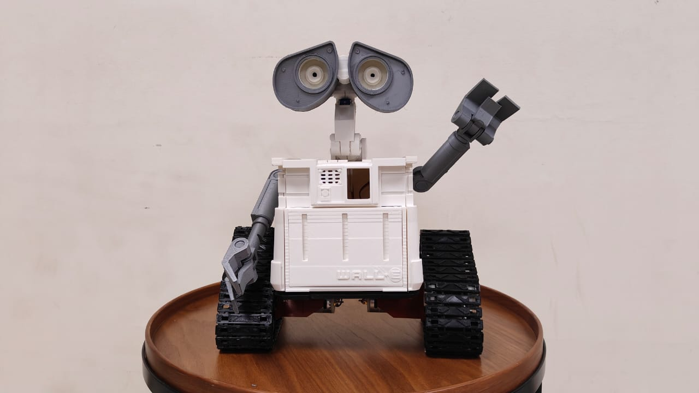

# Helper Robot (ESP32)



Welcome to the   Helper Robot project! This project uses an ESP32 microcontroller with built-in Wi-Fi capabilities to create a robot that can be controlled via a web interface. The robot's functions include moving in various directions and controlling the position of its hands and face.

## Getting Started

Before you can use the robot, there are a few steps you need to follow:

1. **Set Up Wi-Fi**: Open the Arduino code (`helper_robot.ino`) and replace the placeholders with your Wi-Fi network credentials:

   ```cpp
   const char* ssid = "YourWiFiNetworkName";
   const char* password = "YourWiFiPassword";
   ```

2. **Configure Pins**: Make sure to configure the pins for the servo motors and motor driver according to your hardware setup. The default pin configurations are as follows:
    ```cpp
    const int leftServoPin = 5;
    const int rightServoPin = 6;
    const int faceServoPin = 7;

    const int motorPinA = 8;
    const int motorPinB = 9;
    const int motorPinC = 10;
    const int motorPinD = 11;
    ```
3. **Upload the Code**: Upload the modified code to your ESP32 board.

## Usage

Once you've set up your ESP32 and uploaded the code, follow these steps to control the robot:

1. Connect your ESP32 to a power source.
2. Connect your device (computer, smartphone, tablet) to the same Wi-Fi network as your ESP32.
3. Open a web browser and enter the IP address of your ESP32. You can find the IP address in the Arduino Serial Monitor.
4. The web interface will allow you to control the robot's movements and the position of its hands and face.

## Web Interface
The web interface is a simple webpage created using JavaScript and Bootstrap. Ensure that you have an internet connection to access and control the robot through the browser.

    ```html
    <!DOCTYPE html>
    <html>
        <head>
            ...
        </head>

        <body>
            ...
            <script>
                $("#rightHand").on("input change", function () {
                    sendData("right", this.value);
                });

                $("#leftHand").on("input change", function () {
                    sendData("left", this.value);
                });

                $("#face").on("input change", function () {
                    sendData("face", this.value);
                });

                $("#movementBtnL").clickAndHold({
                    timeout: 200,

                    onHold: () => {
                    sendData("move", "left");
                    },

                    onRelease: () => {
                    sendData("move", "stop");
                    },
                });

                $("#movementBtnU").clickAndHold({
                    timeout: 200,

                    onHold: () => {
                    sendData("move", "up");
                    },

                    onRelease: () => {
                    sendData("move", "stop");
                    },
                });

                $("#movementBtnD").clickAndHold({
                    timeout: 200,

                    onHold: () => {
                    sendData("move", "down");
                    },

                    onRelease: () => {
                    sendData("move", "stop");
                    },
                });

                $("#movementBtnR").clickAndHold({
                    timeout: 200,

                    onHold: () => {
                    sendData("move", "right");
                    },

                    onRelease: () => {
                    sendData("move", "stop");
                    },
                });
            </script>
        </body>
    </html>    
    ```

## Credits

This project was created by [Sreshta](mailto:sreshtapothula2@gmail.com). If you have any questions or suggestions, feel free to reach out.

Happy coding! 🚀